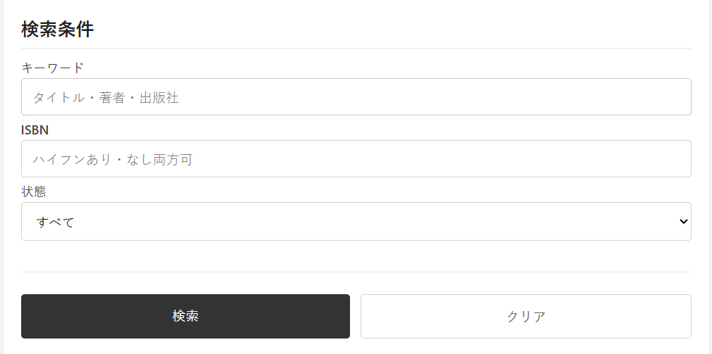
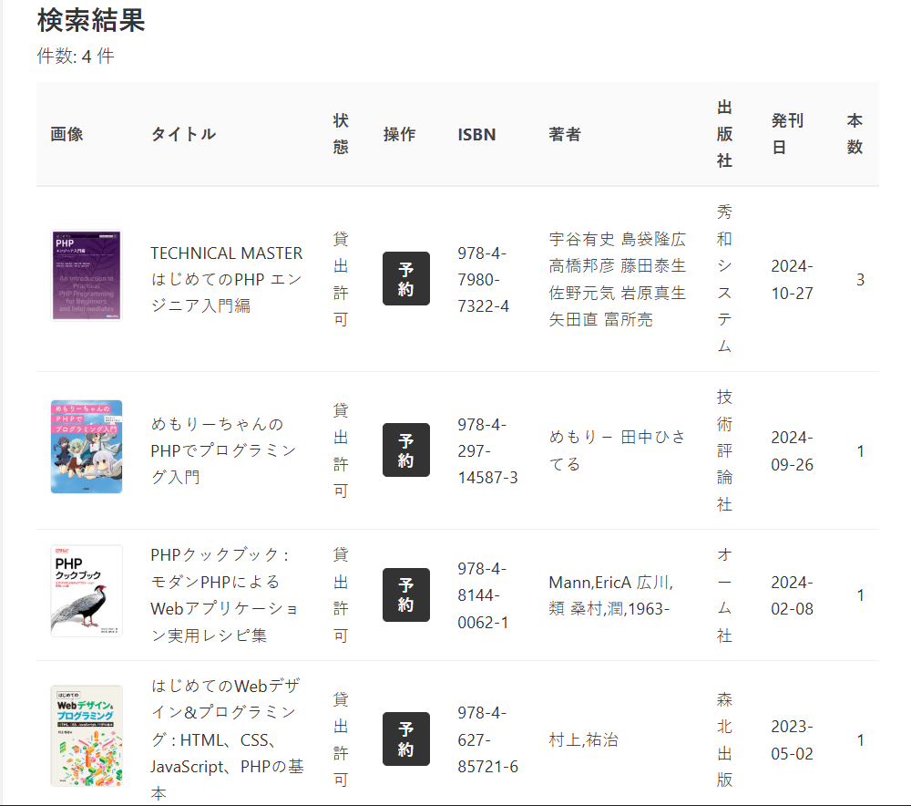
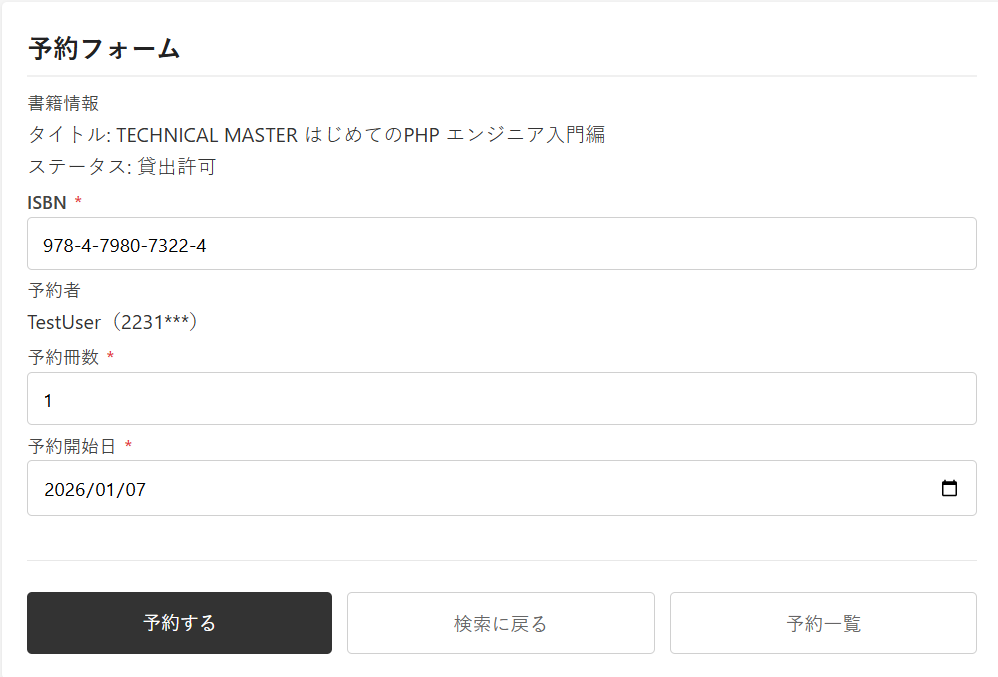
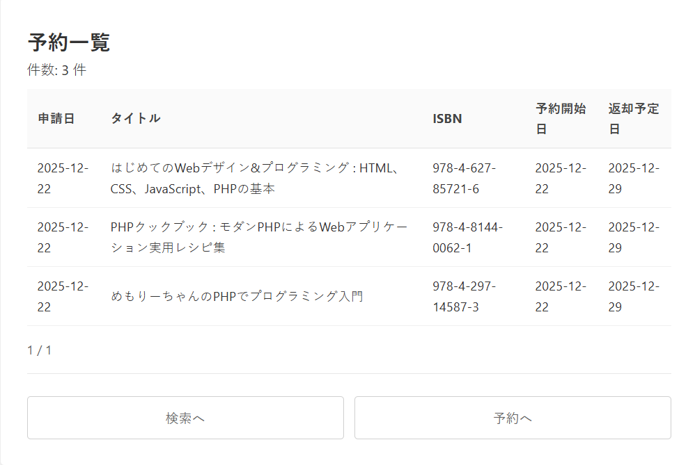

# WebProgram3 

## 1. 概要
本プログラムは九州情報大学付属図書館にて使用される「探して予約君」であり、蔵書の確認・予約を行える。 
また、博多駅前サテライトキャンパスでは蔵書の貸出・返却を行うことができる仕様となっている。 
2025年度後期開講 WebプログラミングⅢにて作成。 

## 2. 仕様
### 2.1 プログラミング言語
本プログラムの作成には主に次のプログラミング言語を使用した。
<li>PHP
<li>CSS
<li>JavaScript 
また、RDBMS(Relational Database Management System)としてMySQLを採用している。 
<!--バージョン・サーバー情報が必要になった場合は追記-->

### 2.2 API
書籍情報取得のため国立国会図書館より公開されている<B>国立国会図書館サーチ</b>と、Google社より提供されている<b>Google Books</b> を併用している[1][2]。主に国立国会図書館サーチ を利用するが、万が一正常に情報を取得できなかった場合Google Booksより書籍情報を取得するよう作成した。

## 3. 使用方法
どちらのキャンパスもまずはKiis出席君にログインを行うことで「探して予約君」にアクセスすることができる[3]。 
その後、「」を選択することで実際に本プログラムを利用することができる。
### 3.1 太宰府キャンパス
太宰府キャンパスでは前述の通り、蔵書の検索・予約を行うことができる。 
ここでいう<b>「予約」</b>とは、蔵書の貸し出しを受けたい旨を図書館に伝えることで、貸し出しまでの工程を削減・簡略化することを目的にしているため、本プログラム上で予約をしたのちに貸し出しを受けに図書館へ訪れる必要がある。 
  
実際に本プログラムにアクセスすると、このような画面に推移する。

この<b>search.php</b>では九州情報大学附属図書館の蔵書をキーワード 又はISBNを指定して検索することができる。ただし、一部蔵書には禁帯出に指定されているものがある。これらの禁帯出に指定されているものに関しては予約・貸し出しが一切できない。もし、貸し出しできるもののみを探している場合は「状態」を"すべて"から"貸出許可"に変更する必要がある。 
 
試しに、検索をかけてみるとこのような結果が出る。
 
これは開発段階のデモ画面のため実際の表記とは異なるものがあるが、基本的には変わりがない。 
もしここに気になる蔵書があり、貸し出しを受けたいときには<b>「予約」</b>のボタンを押す必要がある。ボタンが押下されると対応する蔵書の情報を持った状態で<b>reservation.php</b>に推移する。 

このように検索画面から予約ボタンを押下することで予約フォームに情報を入力することなく辿りつくことができる。 
情報に誤りがない場合はそのまま<b>「予約する」</b>を押下するだけで完了である。もしも間違いや、予約日を変更したい場合は都度変更を行う。 
このような方法で予約に成功した場合ヘッダーメニューにある「予約一覧」から自身の予約を確認することができる。

予約をした場合は、必ず開始日に貸し出しを受けに図書館へ行く必要がある。

### 3.2 博多キャンパス
博多キャンパスはヘッダーメニューにある<b>「博多キャンパス」</b>を押下することで専用画面に推移する。
太宰府キャンパスとの大きな違いは、バーコードを利用してプログラム上で検索から貸し出しまで完結することができる点である。